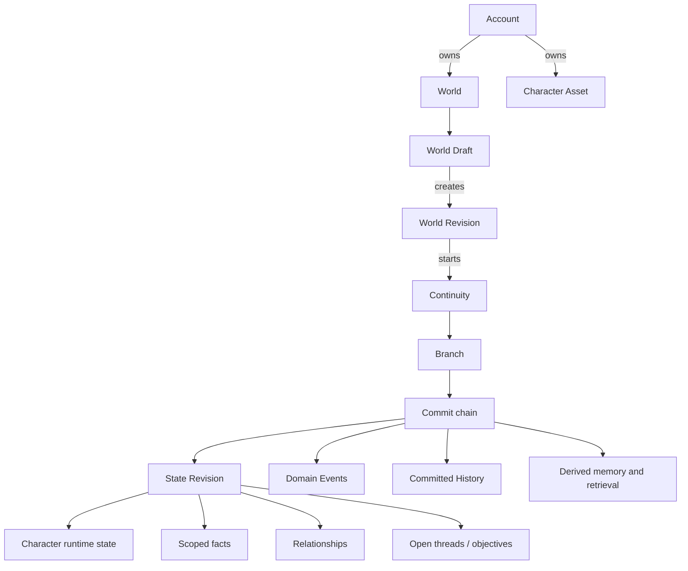

# Domain, State and Data Model

Status: `FROZEN WITH SYSTEM DESIGN V1 AFTER INDEPENDENT REPAIR`

## 1. Purpose

This document defines the original domain language, aggregate boundaries, authoritative state and logical PostgreSQL schema. Names are technical language, not final product copy or UI labels.

## 2. Domain map



## 3. Core terms

| Term | Meaning | Authority boundary |
|---|---|---|
| Account | Adult launch identity and ownership root | Owns assets, grants and eligibility state; never embedded as a character. |
| World | A creator-owned authoring project | Identity/lifecycle root, not a playable state snapshot. |
| World Draft | Mutable working definition | May be incomplete; never changes a running Continuity. |
| World Revision | Immutable, schema-versioned playable definition | Pinned by Continuities and shared packages. |
| Character Asset | Reusable user-owned authored character definition | A source asset; not the same as a character inside a World or Continuity. |
| World Character Spec | A character snapshot/configuration included in a World Revision | Stable within that revision. |
| Continuity | One user's durable investment in one World Revision | Owns Branches and lifecycle/export settings. |
| Branch | One independent causal line within a Continuity | Stores two participation axes and points to one head Commit. |
| Action | Durable command envelope for a user intent and its processing status, including world and protected lifecycle operations | Idempotency boundary; a Branch mutation has zero or one Commit, while a lifecycle Action has zero or one linked terminal domain result. |
| Generation Attempt | One provider/model attempt for an Action | Diagnostic/provenance record; never authoritative world state. |
| Commit | One accepted transition of a Branch | Append-only causal and audit boundary. |
| State Revision | Complete authoritative structured state after one Commit | Immutable and hashable; Branch head selects the current one. |
| Domain Event | A committed occurrence and its causal/source link | Explains what happened; not a transport message. |
| Conversation Entry | A committed user or system-facing historical entry | History, not canonical fact merely because text states it. |
| Recovery Point | A named reference to a Commit | Does not duplicate or mutate state. |
| Derived Memory | Rebuildable summary/index over committed sources | Non-authoritative and scope-limited. |
| Explanation Projection | Filtered explanation of an accessible fact or committed change | Presentation-neutral read model derived from existing state, Commit/Event and Context Manifest records; never canonical and never a raw prompt dump. |
| Export Package | Versioned portable representation of selected authorized content | Immutable generated artifact with manifest/checksum. |

## 4. Aggregate boundaries and invariants

### 4.1 Account and grants

The Account aggregate owns eligibility and asset access. It does not own world-state facts.

Invariants:

- V1 account eligibility is adult or ineligible/unknown; exact verification mechanism is not assumed.
- A resource access check evaluates actor, resource, requested operation, ownership/grant, visibility and lifecycle status.
- Sharing grants are explicit resources; possession of a URL is not ownership.
- Provider/model identifiers and policy flags are server-controlled and cannot be supplied as trusted client authority.

### 4.2 World authoring

The World aggregate owns one current Draft and zero or more immutable Revisions.

A playable World Revision minimally contains a premise, starting situation, the user's role/authority boundary, initial locations/state, at least one playable interaction path, character specs, initial scoped facts/relationships and interaction/safety boundaries. Optional advanced sections may declare world rules, knowledge scopes, causal constraints, custom state and Goal-framed objectives. These are structured product fields; a hidden raw system prompt is not the authority.

Invariants:

- every World and Character Asset has one owner account in V1;
- every World Revision references only authorized assets and records source provenance;
- a Revision is immutable after creation;
- draft validation must succeed before a Revision is marked playable;
- creator text is data, not executable system instruction;
- existing Continuities stay pinned when a new Revision is created.

Character specs may snapshot an authorized reusable Character Asset or be authored directly inside the World. Either path produces the same immutable World Character Spec at revision time; runtime behavior cannot depend on continued access to the source Asset.

### 4.3 Continuity and Branch

The Continuity aggregate is the user's durable play root. Branch is the concurrency and state-evolution boundary.

Invariants:

- a Continuity pins one World Revision in V1;
- every Continuity has at least one Branch and one active Branch;
- each Branch has exactly one current head Commit after initialization, and that head Commit belongs to the Branch;
- `initiative_mode` and `structure_mode` are independent required fields in the head State Revision; no Branch column or client field is a second authority;
- an ordinary Action’s `participationExpectation` must equal the two authoritative values at its `expected_head_commit_id` and can never mutate them;
- only a direct user `CHANGE_PARTICIPATION_CONTRACT` Action may change either axis; it specifies the complete requested contract and current expected head, creates one Commit and records one `PARTICIPATION_CONTRACT_CHANGED` Domain Event;
- a model proposal, generated prose or stale client expectation cannot change either axis;
- a state-mutating Action specifies `expected_head_commit_id`;
- a Commit may advance a Branch only if the expected head still matches;
- branching never changes the source Branch;
- restoring appends a Commit and never deletes intervening history.

### 4.4 Action and Commit

Action is the durable process record; Commit is the accepted state transition.

Invariants:

- `(actor_account_id, operation_scope, idempotency_key)` is unique for the lifetime of the retained Action record;
- one Action can have many Generation Attempts but zero or one Commit;
- a client acknowledgement means the Action is durably recorded, not that a world mutation succeeded;
- only `COMMITTED` confirms authoritative mutation;
- an Action cannot move from a terminal state back to a processing state;
- the same Action cannot settle usage twice;
- model/provider callbacks cannot create a Commit directly.

### 4.5 State Revision

State Revision is a complete, immutable, structured document representing one Branch after one Commit. Full snapshots are chosen for V1 clarity and recoverability. Storage deduplication may change later without changing the logical contract.

Required top-level sections:

```text
schema_version
participation
world_clock
locations
entities
characters
facts
relationships
open_threads
objectives
resources
interaction_boundaries
custom_state
```

Rules:

- every state item has a stable opaque ID;
- every fact or memory-like item declares scope, provenance and lifecycle state;
- `interaction_boundaries` contains Branch-local roleplay/safety preferences only; account eligibility, legal consent, grants and governance decisions remain outside State Revision and cannot be changed by restore;
- unknown data is not fabricated to fill the document;
- `custom_state` is namespaced and schema-validated; it cannot override protected sections;
- state size is measured and bounded operationally, but the 30-day validation fixture is not a maximum capacity specification;
- the stored hash covers canonical serialization for integrity comparison, not user identity or security authorization.

### 4.6 Character identity layers

Three layers remain separate:

1. `CharacterAsset`: optional reusable source definition owned by a creator.
2. `WorldCharacterSpec`: immutable snapshot and role inside a World Revision.
3. `CharacterRuntimeState`: branch-specific current state within a State Revision.

`CharacterRuntimeState` may contain current location, relationship-specific stance, active motives, known fact IDs, temporary conditions and earned development. It cannot mutate the source Asset or Revision.

Character knowledge is allow-listed by scope. A retrieval result never grants knowledge merely because the underlying record exists.

## 5. State, event, history and memory boundaries

### 5.1 Canonical state

Canonical state answers: **what is true now in this Branch?** It includes current facts, current relationship values/qualitative states, current entity/location/resource state, active/open threads, optional objectives, participation settings and Branch-local interaction boundaries. Account eligibility, legal consent, grants and governance decisions are account-domain authority, not Branch state.

It excludes raw prompts, uncommitted generated prose, embeddings and provider reasoning.

### 5.2 Domain events

Domain Events answer: **what committed occurrence caused change?** Each event records:

- `event_type` from an application-owned registry;
- actor/source (`USER`, `CHARACTER`, `WORLD`, `SYSTEM`, `CREATOR_RULE`);
- causal parent event or Action when known;
- affected entity IDs;
- before/after references or a typed change summary;
- visibility scope;
- commit timestamp and world-time value when applicable.

Events are not the sole source from which state must be replayed. They provide causal explanation, integration signals and auditability alongside State Revisions.

### 5.3 History

Conversation entries and narrative output answer: **what was said or shown?** They are attached to a Commit and Branch. They may provide context, but text does not become fact without a validated state change or explicit user confirmation.

Partial streamed drafts are kept only as Generation Attempt diagnostics under short operational retention; they are not conversation history.

### 5.4 Memory taxonomy

| Memory type | Source | Authority | Edit/delete behavior |
|---|---|---|---|
| Scoped fact | user, creator rule or accepted transition | Canonical within scope | correction/supersession through a Commit |
| Relationship state | accepted transition | Canonical current state | change through causal Commit; user correction records provenance |
| Episode | committed Events/History range | Historical source | source preserved subject to lifecycle policy |
| User note | explicit user input | Canonical within declared scope | user can edit/remove through Commit |
| Derived summary | model/system synthesis | Non-authoritative | rebuild, expire or remove without changing canon |
| Retrieval index | facts/events/history-derived | Non-authoritative | rebuildable; never displayed as truth by itself |
| Memory candidate | generated proposed fact/summary | Non-authoritative until promoted | reject, expire or remain/replace as L1 when non-canonical; any promotion/supersession that changes canonical continuity follows the closed L3 decision table and direct user authorization |

### 5.5 Closed consequence-impact decision table

The table below is the minimum classification rule for V1. The deterministic validator derives the final level from operation, target authority, prior scope and effect; a model’s requested label is advisory only. Safety policy or a user-selected stricter world boundary may raise a level but may never lower the listed minimum. `L3` means a direct user confirmation bound to the exact target and resulting change. For an explicit user correction/removal Action, the final direct confirmation of that Action supplies the authorization; the system must show the target, scope and effect before Commit and require renewed confirmation if the expected head or resulting effect changes.

| Change class | Minimum level | Required handling |
|---|---:|---|
| Ranking, token budgeting, provisional draft plans or uncommitted generation | L0 | No canonical mutation or committed-history claim. |
| Derived summaries, embeddings, retrieval indexes, search/return projections and a Memory Candidate that remains non-canonical | L1 | May rebuild, expire, replace or be removed automatically. It must retain permitted source links/freshness and cannot itself alter canonical facts, relationship state, scope or authority. |
| Low-risk, validated world evolution: location/resource updates, an earned relationship shift within declared non-protected bounds, an open-thread update, or a new system/character/world fact that remains within its existing allowed scope and does not supersede a user-owned/confirmed record | L2 | May Commit inside the active participation contract. It requires a causal Event, visible explanation/correction path and an authorized expected-head transition. |
| User-authored canonical fact or user-confirmed canonical fact: removal, replacement, supersession, semantic rewrite or scope/visibility reclassification | L3 | Never silently performed by a model or ordinary L2 evolution. It requires a direct user-authorized Action/Commit with target, before/after effect, scope and provenance. |
| Scope or visibility widening of any canonical record; any scope transformation that could newly expose a private record | L3 | Requires exact direct user authorization and audit. The validator rejects implicit copies or model-proposed widening. |
| Identity, legal consent, permission, external sharing, spend, deletion or other irreversible commitment | L3 | Requires its protected account/lifecycle operation and exact user confirmation; Branch Restore or ordinary world Actions cannot perform it. |
| High-consequence relationship redefinition that changes a declared protected, identity-bound or long-term commitment state | L3 | Requires exact user authorization. Routine L2 relationship evolution remains allowed only outside this protected class. |
| Memory Candidate promotion/supersession that would create, replace, remove, widen or otherwise change a canonical fact or protected relationship state | L3 | Treat as a protected canonical change; a derived summary may still be L1 if it does not make or alter canon. |
| User correction or removal of a canonical fact, relationship state or user note | L3 | Must use an explicit user `CORRECT_CONTINUITY` or `REMOVE_CONTINUITY` Action and one audited Commit; it cannot be inferred from model prose or a generic turn. |

This table does not make every ordinary world change interrupt-driven. It preserves L2 for low-risk, explainable evolution while closing the boundary against silent high-impact changes to user-owned or confirmed continuity.

## 6. Logical PostgreSQL schema

All IDs are opaque, server-generated, time-sortable UUIDs. All mutable rows include `created_at`, `updated_at` where applicable and a monotonic `row_version`. User content is UTF-8. Timestamps are stored in UTC; world time is a separate domain value.

### 6.1 Identity, access and governance

| Table | Key fields and constraints |
|---|---|
| `accounts` | `id`, lifecycle status, locale/timezone; no character persona fields |
| `account_eligibility` | `account_id`, status, jurisdiction_hint, method_ref, decided_at; minimize raw age data |
| `resource_grants` | resource type/id, grantee, role, visibility, expiry/revocation; unique active grant |
| `consent_records` | actor, consent type/version, scope, decision, timestamp, withdrawal link |
| `policy_decisions` | actor/resource/action, policy version, outcome, reason code, appeal state |
| `material_change_notices` | change type/version, effective time, affected capability/scope, recovery link |

### 6.2 Authoring

| Table | Key fields and constraints |
|---|---|
| `worlds` | `id`, owner, lifecycle status, current draft ID; one owner in V1 |
| `world_drafts` | `id`, world ID, schema version, structured document, revision counter |
| `world_revisions` | `id`, world ID, revision number, immutable document, content hash, created_by; unique world/revision |
| `character_assets` | `id`, owner, structured definition, lifecycle status, source provenance |
| `world_revision_characters` | revision ID, stable character spec ID, immutable snapshot/source link; unique per revision/spec |
| `authoring_validation_runs` | draft/revision, validator version, result, findings, created_at |

### 6.3 Runtime and causal state

| Table | Key fields and constraints |
|---|---|
| `continuities` | `id`, owner, pinned world revision, lifecycle status, active branch ID |
| `branches` | `id`, continuity, parent branch/commit, head commit ID, row version; current participation axes are read from the head State Revision, not duplicated as a second authority |
| `actions` | `id`, actor, optional continuity/branch, operation scope/type, idempotency key, optional expected head, validated intent payload/digest, status, acknowledged_at, terminal_at |
| `generation_attempts` | `id`, action, attempt number, task/profile/provider/model/config IDs, context manifest ID, status, latency, usage, error class |
| `action_proposals` | `id`, action, generation attempt, schema version, candidate transition, impact level, proposal digest, status, expiry |
| `action_confirmations` | action/proposal, actor, proposal digest, expected head, confirmed_at; unique active confirmation per proposal/actor |
| `world_commits` | `id`, branch, action ID unique, parent commit, result state revision, commit type, actor/source, reason, committed_at; a `BRANCH_FORK` parent may be in the source Branch |
| `state_revisions` | `id`, branch, source commit unique, schema version, canonical JSON document, content hash |
| `domain_events` | `id`, commit, type, actor/source, cause event/action, payload, visibility scope, world time |
| `conversation_entries` | `id`, commit, branch, role/type, content or object reference, visibility, ordinal; unique commit/ordinal |
| `recovery_points` | `id`, continuity, branch, target commit, label, creator, created_at |

### 6.4 Memory and derived projections

| Table | Key fields and constraints |
|---|---|
| `derived_memories` | branch, source commit range, type, scoped text/data, scope policy, generator config, freshness, superseded state |
| `memory_candidates` | action/attempt, proposed type/value/scope/source, impact level, review/expiry status |
| `context_manifests` | action, state revision, included source IDs/digests, excluded-scope counts, compiler version, token budget |
| `retrieval_documents` | source type/id, branch, scope labels, derived text/vector reference, source revision; rebuildable |
| `return_orientation_projections` | branch/head commit, recent changes/open threads/relationship summary; rebuildable |

An Explanation Projection introduces no new authoritative store or independent state table. It is a scoped response assembled from existing accessible State Revision items, Commit/Domain Event provenance and, where applicable, Context Manifest source IDs. It returns only the target fact/change, permitted source class and Commit reference, permitted scope, current source head/freshness and authorized correction path. It never returns raw prompts, provider reasoning, excluded source identities/counts beyond approved aggregate disclosure, or records unavailable to the requesting user/character.

Derived tables may lag. Every projection response includes the authoritative head it represents. The client must not present a stale projection as current without a stale/loading marker.

### 6.5 Jobs, usage and portability

| Table | Key fields and constraints |
|---|---|
| `durable_jobs` | type, payload reference, status, available/lease times, attempt count, dedupe key |
| `outbox_records` | source transaction/commit, topic, payload, publish state; unique source/topic/dedupe key |
| `usage_quotes` | action type/profile, disclosed unit/cap/cost representation, expiry |
| `usage_reservations` | action unique, quote, amount/allowance, state; at most one active/final reservation per action |
| `usage_ledger_entries` | account, action, type, amount, reason, reversal link; unique action/type sequence |
| `export_jobs` | account, selected scope, status, manifest version, object key, checksum, expiry policy |
| `import_staging` | account, source object, ownership attestation, scan status, parsed proposal, review status |
| `deletion_requests` | actor, target type/id, scope, status, confirmation digest, purge receipt reference |

## 7. Integrity and concurrency constraints

Minimum database-enforced constraints:

- one Commit per Action;
- one State Revision per Commit;
- Branch head must reference a Commit in the same Branch; branch creation therefore creates a `BRANCH_FORK` Commit in the new Branch rather than pointing its head directly at a source-Branch Commit;
- World Revision number and content hash are immutable;
- source and target of a Branch belong to the same Continuity;
- protected action confirmation digest matches the current proposal and expected head;
- an ordinary Action may not change participation axes; a `CHANGE_PARTICIPATION_CONTRACT` Commit must be directly user-authorized, retain the expected-head match and emit its typed Domain Event;
- validator impact level may not be below the closed decision-table minimum for target/effect/scope, and L3 canonical continuity changes require the direct user authorization bound to the target/effect;
- derived rows cannot be referenced as canonical source revisions;
- usage settlement/release is unique per Action;
- visibility/scope values use closed registries, not arbitrary model strings;
- deletion lifecycle forbids new mutations after tombstoning.

Application services additionally validate domain document schemas, authorization, knowledge visibility and consequence policies before the transaction.

## 8. Schema evolution

- Every structured document and API payload carries `schema_version`.
- Readers support the current and explicitly listed prior versions.
- Migration is forward, tested and reversible at deployment level; immutable historical documents are upgraded through read adapters or separately recorded transformed copies, never edited in place.
- Unknown fields are preserved only in namespaced extension areas and never granted authority automatically.
- A schema change affecting export, authorization, recovery or state meaning requires an ADR and migration rehearsal.

## 9. Clean-room boundary

This domain model is derived from the original PRD. Generic terms such as World, Character, Branch, Commit and Event describe the problem domain; no competitor route, page hierarchy, JSON structure, Memory threshold, version merge behavior or feature bundle is adopted. The closed participation-transition and continuity-impact rules are original authority/recovery decisions, not competitor behavior. Creator templates remain test/mechanism references and do not define these schemas.
