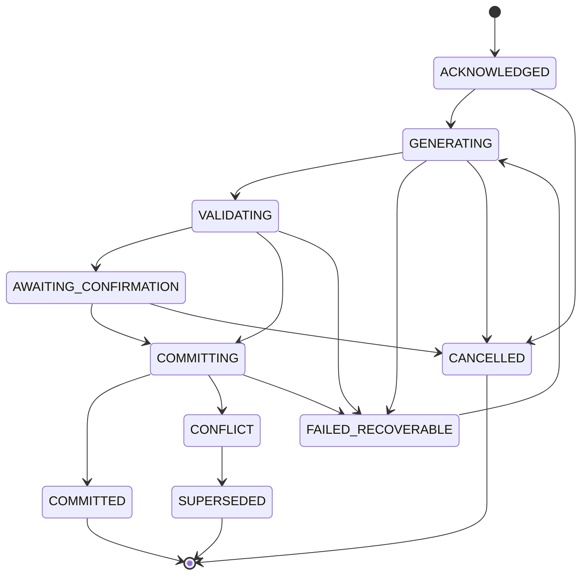

# Runtime, Model and Persistence

Status: `FROZEN WITH SYSTEM DESIGN V1`

## 1. Runtime promise

An important user operation has two separate confirmations:

1. **Durable acknowledgement:** the Action was received and recorded. It may still be processing or unresolved.
2. **Commit confirmation:** the authoritative Branch state and committed history were changed exactly once.

The product must never label acknowledgement as completed mutation. This distinction is central to interruption recovery and the one-second p95 target.

## 2. Action lifecycle



`ACKNOWLEDGED`, `GENERATING`, `VALIDATING`, `AWAITING_CONFIRMATION`, `FAILED_RECOVERABLE` and `CONFLICT` are unresolved states. `COMMITTED`, `CANCELLED` and `SUPERSEDED` are terminal.

Retry uses the same Action and increments Generation Attempt. A materially changed user intent creates a new Action/idempotency key.

## 3. User-turn processing

### 3.1 Synchronous acknowledgement path

The API must perform only bounded work before acknowledgement:

1. authenticate and perform coarse resource authorization;
2. validate envelope shape and supported schema version;
3. verify idempotency key and return the existing Action if present;
4. verify the requested Branch and expected head exist;
5. attach an unexpired usage quote when the action is limited/paid;
6. persist Action, optional usage reservation and job in one transaction;
7. return Action ID, status, current Branch head and progress stream URL.

The one-second p95 target applies to this durable acknowledgement under the supported validation profile. It does not require generation or state transition to finish synchronously.

### 3.2 Asynchronous orchestration path

The worker:

1. leases the Action job and verifies it is still processable;
2. reads one consistent snapshot identified by `expected_head_commit_id`;
3. compiles an authorized context manifest;
4. invokes one or more model tasks through the Model Gateway;
5. validates structured candidate changes against schema, world rules, participation authority, safety and current state;
6. requests explicit confirmation for protected changes;
7. commits an accepted transition or returns a typed recoverable failure;
8. publishes status/output frames from committed outbox records.

Long model calls never hold an open database transaction or Branch lock.

### 3.3 Commit path

The short final transaction rechecks:

- Action is processable and has no existing Commit;
- actor still has authority;
- confirmation is present and matches the proposal when required;
- Branch head equals `expected_head_commit_id`;
- the candidate state is schema-valid and its changes match the validated change set;
- an applicable usage reservation is valid.

On success it writes Commit, State Revision, Domain Events, committed history, usage settlement, Branch head and outbox records atomically.

On head mismatch it writes no world mutation. The Action becomes `CONFLICT`, preserving the candidate for user-visible rebase/retry or supersession. V1 never auto-merges two consequential Branch transitions.

## 4. Streaming contract

SSE frames are resumable using an event cursor. Frame types are:

- `action.status`
- `generation.draft`
- `confirmation.required`
- `action.committed`
- `action.failed`
- `projection.updated`
- `heartbeat`

`generation.draft` is explicitly provisional. It may help responsiveness but is not committed history and cannot be treated as canonical output. `action.committed` carries the Commit ID, resulting head and the final ordered history entries. After reconnect, the client obtains truth from Action and Commit status rather than assuming the last streamed token was saved.

If meaningful output has not begun within ten seconds, the Action remains unresolved and the client receives a recoverable wait state with cancel/retry eligibility. The ten-second rule does not force background work to finish.

## 5. Model orchestration

### 5.1 Model roles

The Model Gateway exposes product tasks, not provider names:

| Task | Output | Authority |
|---|---|---|
| `WORLD_TURN` | narrative draft plus structured candidate transition | proposal only |
| `CHARACTER_RESPONSE` | one or more character actions/utterances with rationale references | proposal only |
| `STATE_EXTRACTION` | fact/event/relationship candidates grounded in source IDs | proposal only |
| `MEMORY_SUMMARY` | derived scoped summary | non-authoritative projection |
| `RETURN_ORIENTATION` | recap proposal grounded in committed sources | non-authoritative projection |
| `IMPORT_TRANSFORM` | inspectable migration proposal | staging only |
| `AUTHORING_CHECK` | validation findings | advisory |

A single provider call may combine compatible tasks to reduce latency/cost, but it must still return separately validated narrative and state-change sections.

### 5.2 Capability profiles

Routing uses a server-owned `ModelCapabilityProfile` with declared support for structured output, context budget class, latency class, safety controls and task suitability. It is versioned independently from product copy and pricing.

The routing policy may choose primary and fallback providers. It must preserve:

- authoritative state and access scope;
- the participation contract;
- maximum allowed consequence impact;
- output schema;
- traceable model/config identity;
- no-training/retention configuration required by approved privacy policy.

Model choice may change prose quality; it may not change permissions or canonical truth.

### 5.3 Context compiler

The Context Compiler builds a manifest from a fixed Branch head. It includes, in priority order:

1. participation and safety/consent contract;
2. immutable World Revision rules and starting context;
3. current authoritative facts/state relevant to the scene;
4. selected character identity, knowledge allow-list and relationship state;
5. relevant committed events/open threads;
6. bounded recent committed conversation;
7. derived summaries only with source links and freshness metadata.

Authorization and knowledge-scope filtering happen **before** relevance scoring or vector/semantic search. Retrieval cannot use a record the target actor/character is not permitted to know. The manifest records included source IDs/digests, compiler version and excluded-scope counts, but never stores provider reasoning.

### 5.4 Structured candidate transition

The model returns a versioned proposal containing:

- narrative entries;
- proposed Domain Events;
- typed state operations (`ADD`, `UPDATE`, `SUPERSEDE`, `REMOVE`);
- cause/source references;
- affected entities and scopes;
- consequence impact level;
- requested protected actions;
- unresolved ambiguities or confidence warnings.

The deterministic validator rejects:

- unknown operation/field types;
- changes outside the expected Branch/head;
- user-avatar action or protected commitment without confirmation;
- changes to permissions, usage or deletion through model output;
- knowledge leakage or private-scope disclosure;
- deletion/supersession without a valid target/source;
- causal references outside the authorized context;
- state changes that conflict with immutable World Revision rules or active safety policy.

Model confidence is advisory and never substitutes for these checks.

### 5.5 Failure and fallback

| Failure | Product behavior |
|---|---|
| timeout/transient provider error | keep Action unresolved; retry same profile or approved fallback; no state mutation |
| invalid structured output | retry with bounded repair attempt; otherwise recoverable failure |
| safety refusal | record typed provider/policy reason; do not invent an alternate unsafe path |
| capability/profile unavailable | disclose degraded state; allow safe retry/cancel; state remains intact |
| partial draft then disconnect | discard or retain only diagnostic draft; reconnect from durable Action status |
| validation conflict | do not auto-commit; show actionable conflict/retry path |
| all attempts exhausted | `FAILED_RECOVERABLE`; release unsettled reservation and retain last safe state |

Attempt limits, timeouts and provider order are configuration with tested bounds, not model-generated decisions.

## 6. World and character evolution

Every accepted transition identifies an initiating Action, one or more causal sources and affected state items. Open-ended does not mean causeless; Goal-framed does not grant the model more user authority.

### Direct

- World/characters respond to explicit user input.
- The model may propose immediate consequences logically required by the action.
- It does not introduce optional proactive character/world commitments without a user prompt.

### Guided

- The model may propose prompts, character initiatives and bounded scene developments.
- Ordinary L2 world consequences may commit with the turn when valid.
- Protected user actions remain proposals.

### World-active

- The model may advance bounded background actors/events during an active user-triggered cycle or explicit continuation boundary.
- Every change remains causal, logged and recoverable.
- V1 performs no unattended off-session authoritative mutation.

### Goal-framed

Optional objectives, constraints, resources, failure consequences and completion state live in their own State Revision section. Open-ended branches omit or leave this section inactive. Failure may emit a transformed state and new thread rather than a terminal marker.

## 7. Persistence and recovery

### 7.1 Automatic persistence

Every successful authoritative transition is a Commit. There is no interval in which the UI may confirm success while the change exists only in client memory or a model stream.

Client drafts and unsent authoring text may use local recovery, but they are not world-state commitments until acknowledged by the server.

### 7.2 Recovery points

A Recovery Point is a label/reference to a Commit. It is cheap, immutable and may be created manually or at disclosed high-impact boundaries. Deleting a label does not delete the referenced Commit while the Continuity remains retained.

### 7.3 Branch

Creating a Branch:

1. validates access to the source Commit;
2. creates a new Branch whose parent pointers reference the source Branch/Commit;
3. creates a `BRANCH_FORK` Commit in the new Branch and a new immutable State Revision copied from the source revision with lineage recorded;
4. initializes the new Branch head to that new Commit;
5. records independent participation contracts (initially copied);
6. leaves the source Branch unchanged.

Subsequent Commits are independent. V1 has no automatic branch merge. Export may include lineage.

### 7.4 Restore

Restore never truncates history. It creates a new Commit on the current Branch with a new State Revision based on selected world-state sections from the earlier revision, plus an event that records the restored source and affected scope. V1 restore can include world clock/location/entity/character runtime facts, relationships, threads, objectives and world resources. It does not restore the participation contract, Branch-local interaction boundaries, account eligibility/consents, ownership, grants, exports, usage ledger or other account-level data; those require their own protected operations.

The user must see a scope preview before confirming a restore. If the current Branch head changed after preview, confirmation fails with a conflict and must be regenerated.

### 7.5 Destructive rewind

Destructive truncation is out of V1. If UX uses the word “rewind,” it must map either to Branch or non-destructive Restore and explain that later history is retained. A future destructive operation requires a new product decision, ADR and deletion/recovery policy.

### 7.6 Backups and operational recovery

PostgreSQL uses managed encryption, automated backups and point-in-time recovery; object storage uses versioning/lifecycle protection for active exports/assets. Before release, restoration drills must prove referential integrity among Branch heads, Commits, State Revisions and object manifests.

Exact disaster-recovery SLOs and commercial retention are open product/operations decisions. The architecture must not claim they are implied by the 30-day scenario.

## 8. Export, import and deletion

### 8.1 Portable export

The versioned export is a ZIP containing only user-selected, authorized scopes:

```text
manifest.json
world/world.json
characters/*.json
continuity/state.json
history/events.ndjson
history/conversation.md        optional
assets/*                       authorized items only
checksums.sha256
```

The manifest records format/schema version, source product version, export time, selected scopes, provenance, omitted private/unsupported material and checksums. JSON/NDJSON supports reuse; Markdown provides human-readable history. The package never includes provider prompts, secrets, hidden safety configuration, embeddings or other users' private data.

### 8.2 Import/migration staging

Import never writes directly into a World or Continuity. It follows:

`upload → malware/type/size scan → parse as untrusted data → proposed facts/characters/relationships → user scope/rights review → corrections → create new draft/continuity → commit`

The original upload remains available according to disclosed retention while review is active. User ownership/authorization is attested and recorded. Third-party `REF-ONLY` research material is not eligible merely because it exists in the repository.

### 8.3 Deletion

Deletion is a lifecycle workflow:

1. calculate and display affected owned resources, shared grants, exports and retained audit categories;
2. obtain confirmation bound to the calculated scope;
3. tombstone the target atomically and block new mutations;
4. enqueue purge of content/object/derived indexes according to approved policy;
5. issue a purge status/receipt while retaining only legally/operationally permitted minimal audit markers.

No retention duration is invented here. Deletion never masquerades as restore or branch cleanup.

## 9. Usage and charge safety

For any future paid or limited action:

- a quote is shown before acceptance;
- the quote identifies failure/retry/cancel behavior;
- one reservation is keyed to the Action;
- no final user charge/allowance consumption occurs more than once;
- V1 default is to settle on Commit and release on terminal no-Commit failure;
- internal provider cost can be metered separately and is not silently passed to the user;
- cancellation/downgrade does not delete user-owned world assets or committed continuity.

Changing the settlement policy requires an explicit product decision and a compatible ledger migration, not a model or UI change.

## 10. Projection freshness

Return orientation, search, summaries and other projections include `source_head_commit_id`. If it differs from the current Branch head, the API marks the projection stale and either serves it with that disclosure or rebuilds it. Core state reads can always fall back to the authoritative State Revision.

This prevents an asynchronous projection, cache or client stream from becoming a competing truth.
