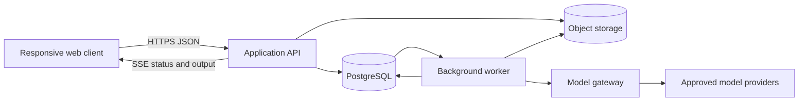

# System Design V1

Status: `SYSTEM DESIGN V1: FROZEN`

Date: `2026-08-27` (`Asia/Shanghai`)

This is the original System Design derived from the frozen [Product Definition Handoff](../product/PRODUCT_DEFINITION_HANDOFF.md), [Product Requirements V1](../product/PRODUCT_REQUIREMENTS.md) and [Product Principles](../product/PRODUCT_PRINCIPLES.md). It defines implementation boundaries and contracts; it does not contain product code, UX layouts, a prototype or a final brand decision.

## 1. Design objective

Provide the smallest architecture that can reliably support a player-first, continuity-first AI world:

- a user can start and resume a personal world;
- the AI can take bounded initiative without taking the user's authority;
- facts, relationships, consequences and recovery remain coherent across model and service failures;
- generated prose, authoritative state, history and derived memory cannot silently impersonate one another;
- every acknowledged consequential operation is either committed once or remains visibly unresolved;
- the design can pass the 30-day / 20-session validation scenario without interpreting it as a retention limit or synchronous-work requirement.

## 2. Binding inputs and priority

When inputs disagree, apply this order:

1. Frozen Product Requirements and their acceptance conditions.
2. Frozen Product Principles and Product Positioning.
3. Integrated user evidence and Conflict Register.
4. Original content and creator-pattern material as fixtures or mechanism references.
5. WorldOS and other competitors as bounded risk evidence only.

No design element in this package is justified solely by competitor parity, a template field, an available asset or an immersion demo.

## 3. V1 architectural posture

### 3.1 Deployment shape

V1 uses a **modular monolith with an independently scalable worker process**, not microservices.

The API and worker are separate runtime processes built from one codebase and one set of domain contracts. They may scale independently without becoming separate ownership or consistency domains.

### 3.2 Technology baseline

| Layer | V1 decision | Boundary |
|---|---|---|
| Client | TypeScript + React responsive web client | No UI layout or component system is selected here. |
| Server and worker | TypeScript on Node.js | Exact web, job and validation libraries are implementation-level selections that must preserve these contracts. |
| Authoritative store | Managed PostgreSQL | No cache, search index or vector store may become authoritative. |
| Large artifacts | S3-compatible object storage | Used for exports and approved user assets; metadata and access authority stay in PostgreSQL. |
| API | Versioned HTTPS JSON plus Server-Sent Events for one-way progress/output streaming | WebSocket is not required for the single-user MVP. |
| Asynchronous work | PostgreSQL-backed durable jobs plus transactional outbox | No message broker is required until measured load justifies one. |
| Model access | Provider-neutral server-side model gateway | Provider/model choice and commercial packaging remain open. |
| Delivery | Containerized web API and worker, with managed database and object storage | Cloud vendor and regional topology are not selected. |

The baseline deliberately excludes microservices, Kafka, a separate vector database, distributed sagas and a mandatory Redis tier. An accepted ADR and measured need are required to add them.

## 4. System modules

The modules are logical ownership boundaries inside the modular monolith. Cross-module writes are coordinated through application services and one database transaction when they form one user-visible commitment.

| Module | Owns | Must not own |
|---|---|---|
| Identity & Access | account identity, adult-eligibility status, sessions, asset roles and grants | world state, model prompts or creator content |
| World Authoring | mutable drafts, reusable character assets, validation and immutable World Revisions | a participant's evolving continuity |
| Continuity Runtime | Continuity, Branch, participation contracts and current head | global account rights or raw provider configuration |
| Action Coordinator | durable action envelope, idempotency, lifecycle, confirmation and commit orchestration | canonical facts outside a committed transition |
| State & Consequence | immutable State Revisions, Commits, domain events and causal links | generated drafts or retrieval scores |
| Context & Memory | scoped memory records, derived summaries, context manifests and retrieval indexes | permission decisions or canonical truth inferred only from prose |
| Character Runtime | runtime character identity/development/knowledge boundaries | the user's avatar decisions or account authority |
| Model Gateway | provider adapters, capability profiles, attempts, structured-output validation and fallback | direct database mutation |
| Recovery & Portability | recovery points, branch/restore operations, exports, staged imports and deletion workflows | live world mutation outside normal commit rules |
| Entitlement & Usage | quotes, reservations and append-only settlement ledger | inference about charge from rendered UI state |
| Governance & Audit | safety decisions, consent records, material-change notices and audit trail | hidden policy that bypasses domain authorization |

## 5. Authoritative-state rule

The following classification is binding.

| Information class | Authority | Mutability and recovery |
|---|---|---|
| Authored World Revision | Immutable, versioned product data | A new revision is created; existing Continuities remain pinned. |
| Branch State Revision | Authoritative world/relationship/runtime state at one commit | Immutable; a new commit creates a new revision. |
| Branch head | Authoritative pointer to current committed state | Compare-and-swap update inside the commit transaction. |
| Commit and Domain Event | Authoritative record of an accepted transition and its causal explanation | Append-only; content subject to governed redaction/purge rules. |
| Conversation history | Historical record of committed user and system-facing output | Append-only per commit; not canonical truth by itself. |
| User-authored or confirmed memory | Authoritative only within its declared scope | Corrected by a new commit that supersedes the old item. |
| Model-generated memory candidate | Non-authoritative proposal | May be rejected, expired or promoted through policy and audit. |
| Derived summary, embedding, search index or cache | Rebuildable projection | Never used as sole authority; safe to discard and rebuild. |
| Streaming/generated draft | Non-authoritative until its Action is committed | A failed draft cannot mutate state or appear as committed history. |
| Account permission, entitlement and usage ledger | Authoritative in its owning module | Changes require audited domain operations; never inferred from world state. |

Rendered UI state is always a projection. If it conflicts with an authoritative record, the authoritative record wins and the discrepancy must be surfaced and repaired.

## 6. Core consistency boundary

A consequential interaction is one `Action`. The server first durably records its intent and idempotency key, performs generation outside a database transaction, validates the candidate result, and then applies all accepted world changes in one short PostgreSQL transaction.

That final transaction:

1. verifies account authority, Action status and expected Branch head;
2. creates one Commit and one immutable State Revision;
3. appends committed conversation entries and Domain Events;
4. advances the Branch head with optimistic concurrency;
5. settles or releases any usage reservation exactly once;
6. writes an outbox record for projections and notifications;
7. marks the Action `COMMITTED`.

A unique constraint on `action_id` permits at most one Commit. Provider requests and workers may be retried; the product commitment may not be duplicated. This provides product-level once-only commitment without claiming distributed exactly-once delivery.

## 7. Participation and autonomy boundary

The architecture stores two independent values; it never combines them into one mode enum:

- `initiative_mode`: `DIRECT | GUIDED | WORLD_ACTIVE`
- `structure_mode`: `OPEN_ENDED | GOAL_FRAMED`

Both are versioned in the Branch state. The default is `GUIDED + OPEN_ENDED`.

All modes reserve these actions to the user unless a future product decision explicitly reopens the boundary: user-avatar speech/action, identity changes, external sharing, resource spending, paid usage, permission changes, deletion and other irreversible commitments. A model may propose these actions but cannot commit them.

V1 `WORLD_ACTIVE` may advance bounded background world activity during a user-initiated orchestration cycle or explicit session-boundary continuation. It does not authorize unattended off-session mutation. That limitation reduces silent change and scheduler complexity while preserving a future extension point.

## 8. World-definition and continuity boundary

- A `World` is the owned authoring project.
- A `WorldDraft` is mutable authoring state.
- A `WorldRevision` is an immutable playable definition.
- A `Continuity` is one user's evolving play investment pinned to one World Revision.
- A `Branch` is one causal line inside a Continuity.

Editing a World never silently changes an existing Continuity. V1 does not automatically merge a new World Revision into an active Continuity. A future explicit adoption workflow may be added only with preview, conflict handling, a preserved original and its own ADR.

## 9. Recovery semantics

System contracts distinguish:

- **continue:** append a new Commit to the current Branch;
- **recovery point:** name an immutable Commit for later use;
- **branch:** create a new Branch from an existing Commit without changing the source Branch;
- **restore:** create a new Commit whose state is based on an earlier State Revision while retaining intervening audit/history;
- **destructive rewind:** not supported in V1;
- **delete:** a governed asset-lifecycle operation, never a history-navigation shortcut.

Automatic commit persistence is not presented as the same promise as a user-created recovery point.

## 10. Requirement-to-design traceability

| Requirement | Primary design owner | Contract / validation anchor |
|---|---|---|
| PR-001 | Continuity Runtime, Action Coordinator | Separate initiative/structure fields; protected-action validator |
| PR-002 | World Authoring | Draft-to-playable-revision contract |
| PR-003 | Context & Memory, Continuity Runtime | Current-state projection and return-orientation query |
| PR-004 | State & Consequence, Context & Memory | Scoped state items, provenance and correction Commit |
| PR-005 | State & Consequence | Causal Domain Events and validated transition proposal |
| PR-006 | Character Runtime, Governance | identity/knowledge scopes and protected user-authority rules |
| PR-007 | State & Consequence, Governance & Audit | source/cause/scope recorded on consequential changes |
| PR-008 | Recovery & Portability | distinct recovery-point, branch, restore and delete contracts |
| PR-009 | Recovery & Portability | versioned readable export and lifecycle status |
| PR-010 | Model Gateway, State & Consequence | provider-independent state and recorded Generation Attempts |
| PR-011 | World Authoring | progressive structured draft; no hidden prompt authority |
| PR-012 | World Authoring | isolated preview Continuity when the SHOULD is selected |
| PR-013 | Identity & Access, Governance & Audit | eligibility, visibility, consent and appeal records |
| PR-014 | Entitlement & Usage | pre-action quote, reservation and idempotent settlement |
| PR-015 | Continuity Runtime, State & Consequence | optional Goal-framed state section |
| PR-016 | Recovery & Portability | quarantined import, user review and preserved source archive |
| PR-017 | Identity & Access, Recovery & Portability | explicit grants and revision-pinned package sharing |
| PR-018 | Projection boundary only | no MVP feature; any future layer reads committed state |
| NFR-001 | Action Coordinator, State & Consequence | durable acknowledgement and atomic Commit protocol |
| NFR-002 | Client/API contracts | semantic output, keyboard/screen-reader/no-audio/reduced-motion paths |
| NFR-003 | Client projection boundary | core loop has no sensory dependency |
| NFR-004 | Governance & Audit, Model Gateway | material-change records and model capability profile history |
| NFR-005 | Identity & Access, Context & Memory | scope authorization before retrieval and provider calls |
| NFR-006 | All core runtime modules | long-horizon scenario suite |
| NFR-007 | Action Coordinator, SSE contract | durable acknowledgement metric and recoverable wait states |

Detailed domain structures are in [DOMAIN_STATE_AND_DATA_MODEL.md](DOMAIN_STATE_AND_DATA_MODEL.md). Runtime behavior is in [RUNTIME_MODEL_AND_PERSISTENCE.md](RUNTIME_MODEL_AND_PERSISTENCE.md).

## 11. Decisions intentionally not invented

System Design keeps seams for, but does not decide:

- exact original launch-scenario emphasis;
- capacity and retention beyond the frozen validation minimum;
- launch regions, jurisdiction-specific age verification and appeal service levels;
- final prices, allowance policy, model/provider presentation and model packaging;
- creator licensing terms and public marketplace mechanics;
- any optional sensory feature, final visual direction or final brand.

These are not implementation defaults. They require the product or specialist decision named in the Product Definition Handoff.

## 12. Related design documents

- [Domain, State and Data Model](DOMAIN_STATE_AND_DATA_MODEL.md)
- [Runtime, Model and Persistence](RUNTIME_MODEL_AND_PERSISTENCE.md)
- [API, Security and Operations](API_SECURITY_AND_OPERATIONS.md)
- [Architecture Decisions](ARCHITECTURE_DECISIONS.md)
- [Validation Strategy](VALIDATION_STRATEGY.md)
- [Architecture Consistency Audit](ARCHITECTURE_CONSISTENCY_AUDIT.md)
- [System Design Handoff](SYSTEM_DESIGN_HANDOFF.md)

## 13. Phase boundary

`SYSTEM DESIGN V1: FROZEN`

`PRODUCT IMPLEMENTATION: NOT STARTED`

This document authorizes later Experience Design and a prototype only when the user starts those phases. It is not product code or permission to implement automatically.
